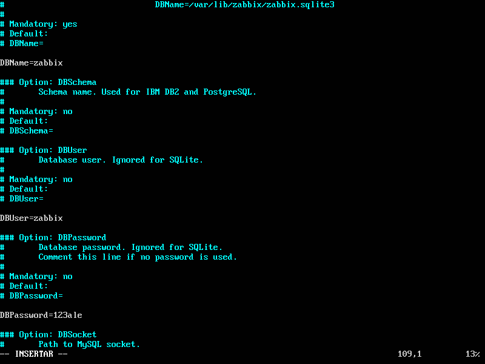
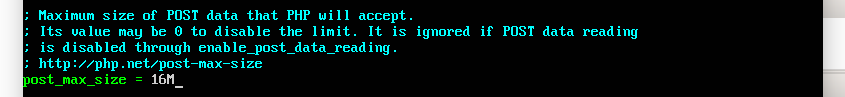
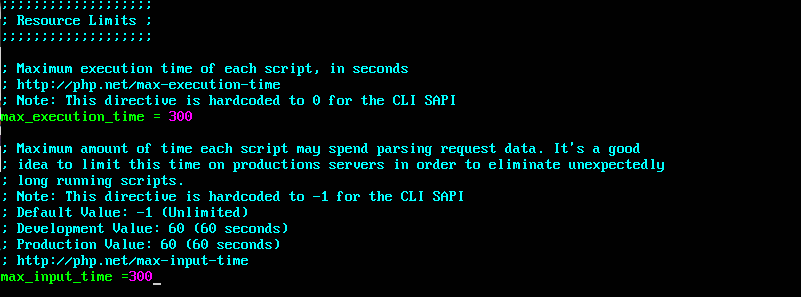

# Configuración Monitorización con Zabbit
## Instalación
* Bajamos el paquete necesario
~~~
sudo wget http://repo.zabbix.com/zabbix/3.4/ubuntu/pool/main/z/zabbix-release/zabbix-release_3.4-1+xenial_all.deb
~~~
* Instalamos el paquete necesario
~~~
sudo dpkg -i zabbix-release_3.4-1+xenial_all.deb
~~~
* Actualzamos repositorios
~~~
sudo apt-get update
sudo apt-get install zabbix-server-mysql zabbix-frontend-php php7.0-mbstring php7.0-bcmath php7.0-xml curl
~~~

##Crear e Importar base de datos

* Accedemos a mysql con usurio root
~~~
mysql -u root -p
~~~
* Creamos la base de datos
~~~
create database zabbix character set utf8 collate utf8_bin;
~~~
* Le damos privilegios al usuario zabbix y asignamos contraseña
~~~
 grant all privileges on zabbix.* to zabbix@localhost identified by '123ale';
~~~
* salimos de mysql
~~~
quit
~~~

* para importar los datos tenemos que utilizar tres archivos **schema.sql.gz**, **images.sql.gz**,**data.sql.gz** 
~~~
sudo zcat /usr/share/doc/zabbix-server-mysql/schema.sql.gz | mysql -uzabbix -p zabbix
sudo zcat /usr/share/doc/zabbix-server-mysql/data.sql.gz | mysql -uzabbix -p zabbix
sudo zcat /usr/share/doc/zabbix-server-mysql/images.sql.gz | mysql -uzabbix -p zabbix
~~~
* En algunas versiones solo tenemos un archivo llamado **create.sql.gz**
~~~
sudo zcat /usr/share/doc/zabbix-server-mysql/create.sql.gz | mysql -uzabbix -p zabbix 
~~~
* Editamos el fichero de configuración **zabbix_server.conf** referente a los datos de conexión con la base de datos
~~~
 sudo vi /etc/zabbix/zabbix_server.conf contenido:
~~~
*  comprobamos ymodificamos las lineas
~~~
DBHost=localhost
DBName=zabbix
DBUser=zabbix
DBPassword=123ale
~~~

##Arrancamos servicio Zabbit
~~~
sudo service zabbix-server start
~~~
* habilitar enlaces a los scripts de zabbit al iniciar el sistema
~~~
update-rc.d zabbix-server enable
~~~

## Configurar PHP para Zabbix
* Modificar o añadir estas lineas 
~~~
post_max_size = 16M
max_execution_time = 300
max_input_time = 300
date.timezone = Europe/Madrid
~~~
en el archivo **/etc/php/7.0/apache2/php.ini**

~~~
sudo vi /etc/php/7.0/apache2/php.ini
~~~	

## Reiniciamos el servidor apache
sudo service apache2 restart

##Configurar servidor Zabbix

* Accedemos a http://192.168.56.11/zabbix/setup.php

