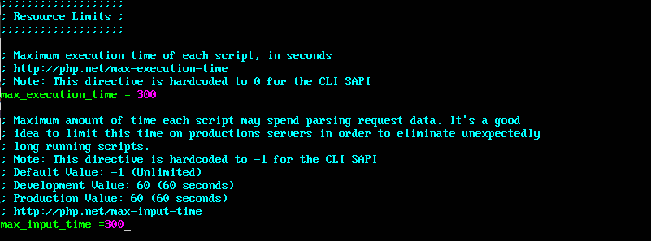
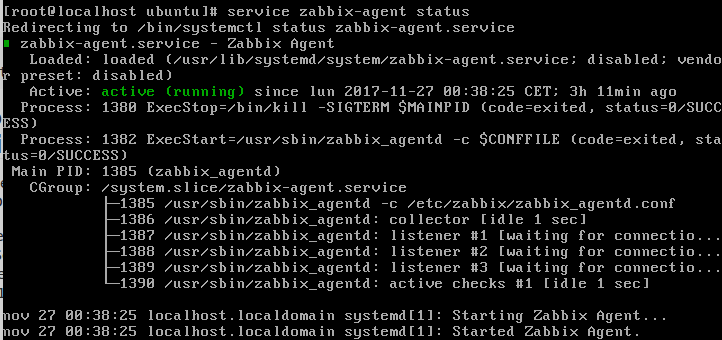

# Configuración Monitorización con Zabbit
## Instalación
* Bajamos el paquete necesario
~~~
sudo wget http://repo.zabbix.com/zabbix/3.4/ubuntu/pool/main/z/zabbix-release/zabbix-release_3.4-1+xenial_all.deb
~~~
* Instalamos el paquete necesario
~~~
sudo dpkg -i zabbix-release_3.4-1+xenial_all.deb
~~~
* Actualizamos repositorios
~~~
sudo apt-get update
sudo apt-get install zabbix-server-mysql zabbix-frontend-php php7.0-mbstring php7.0-bcmath php7.0-xml curl
~~~

##Crear e Importar base de datos

* Accedemos a mysql con usuario root
~~~
mysql -u root -p
~~~
* Creamos la base de datos
~~~
create database zabbix character set utf8 collate utf8_bin;
~~~
* Le damos privilegios al usuario zabbix y asignamos contraseña
~~~
 grant all privileges on zabbix.* to zabbix@localhost identified by '123ale';
~~~
* salimos de mysql
~~~
quit
~~~

* para importar los datos tenemos que utilizar tres archivos **schema.sql.gz**, **images.sql.gz**,**data.sql.gz** 
~~~
sudo zcat /usr/share/doc/zabbix-server-mysql/schema.sql.gz | mysql -uzabbix -p zabbix
sudo zcat /usr/share/doc/zabbix-server-mysql/data.sql.gz | mysql -uzabbix -p zabbix
sudo zcat /usr/share/doc/zabbix-server-mysql/images.sql.gz | mysql -uzabbix -p zabbix
~~~
* En algunas versiones solo tenemos un archivo llamado **create.sql.gz**
~~~
sudo zcat /usr/share/doc/zabbix-server-mysql/create.sql.gz | mysql -uzabbix -p zabbix 
~~~
* Editamos el fichero de configuración **zabbix_server.conf** referente a los datos de conexión con la base de datos
~~~
 sudo vi /etc/zabbix/zabbix_server.conf contenido:
~~~
*  comprobamos ymodificamos las lineas
~~~
DBHost=localhost
DBName=zabbix
DBUser=zabbix
DBPassword=123ale
~~~

##Arrancamos servicio Zabbit
~~~
sudo service zabbix-server start
~~~
* habilitar enlaces a los scripts de zabbit al iniciar el sistema
~~~
update-rc.d zabbix-server enable
~~~

## Configurar PHP para Zabbix
* Modificar o añadir estas lineas 
~~~
post_max_size = 16M
max_execution_time = 300
max_input_time = 300
date.timezone = Europe/Madrid
~~~
en el archivo **/etc/php/7.0/apache2/php.ini**

~~~
sudo vi /etc/php/7.0/apache2/php.ini
~~~	

## Reiniciamos el servidor apache
sudo service apache2 restart

## Configurar servidor Zabbix

* Accedemos a http://192.168.56.11/zabbix/setup.php

Y nos aparecera una página de login e introduciremos **Admin** de usuario y **zabbix** de contraseña. A partir de aquí nos aparecera una página de bienvenida. donde introducir nombre del servidor, contraseñas y nombre de la base de datos  en los cuales introduciremos y sguiriamos dando al siguiente paso.

## Instalación y configuración agente Zabbix- Ubuntu
* Instalamos
~~~
sudo apt-get install zabbix-agent
~~~

* Archivo de configuración **/etc/zabbix/zabbix_agentd.conf**
~~~
Server=127.0.0.1
ServerActive=127.0.0.1
Hostname=Zabbix server Ubuntu
~~~
Como estamos en la misma máquina utilizamos la interfaz lo para acceder al servidor Zabbix

* Habilitamos script de arranque del sistema
~~~
sudo update-rc.d zabbix-agent enable
~~~
* Iniciamos agente Zabbix:
~~~
sudo service zabbix-agent start
~~~
* reiniciamos apache
~~~
sudo service apache2 restart
~~~

## Instalación y configuración agente Zabbix- CentOS
* Instalamos
~~~
su
yum install zabbix-agent
~~~
En mi caso el sistema no lo encontraba el paquete
~~~
su
yum search zabbix-agent
~~~
solo me mostraba un paquete referente al pcp

*Añadimos repositorio
~~~
su
rpm -Uvh http://repo.zabbix.com/zabbix/3.0/rhel/7/x86_64/zabbix-release-3.0-1.el7.noarch.rpm
~~~

* Ya si podemos instalarlo
~~~
su
yum install zabbix-agent
~~~

* Archivo de configuración **/etc/zabbix/zabbix_agentd.conf**
~~~
su
vi /etc/zabbix/zabbix_agentd.conf
~~~

~~~
ServerActive=192.168.56.105
Server=192.168.56.105
Hostname=Zabbix server Ubuntu
~~~

* Reiniciamos el agente
~~~
su
service zabbix-agent restart
~~~

##Configurar monitorización agentes Zabbix
Por defecto podemos ver que en Configuration>Host existe un servidor que su estado es "Disabled" pulsamos y lo activamos

* Creamos un Host Nuevo e introducimos
	* Host Name: CenterOsServer
	* New group : ZabbixAgents
	* Agent interfaces: 192.168.56.110

y pulsamos add

* Introducimos de que queremos monitorizar añadiendo una plantilla predefinida
	* por ejemplo Zabbix Agent, Os Linux.
* vemos en la columna Availability que tenemos no encuentra el agente conexión (ZBX en color gris)
* comprobamos el estado del agente en CentOS 
~~~
su
service zabbix-agent status
~~~

vemos que esta activo

* activamos el puerto *10050* en firewall 
~~~
firewall-cmd --add-port=10050/tcp --permanent
~~~

* ya comprobamos como funciona

# Añadir monitorización de ssh y http
* Añadimos un nuevo item
	* en Host>ElecciónAgente>Items>Create item
		* **HTTP**
			* Name: Servicio http
			* Type: Zabbix agent
			* Key: net.tcp.service[http,192.168.56.110,80]
			* New applications http
		* **SSH**
			* Name: Servicio de ssh
			* Type: Zabbix agent
			* Key: net.tcp.service[http,192.168.56.110,20022]
			* New applications ssh
* Añadir un nuevo trigger
	* en Host>ElecciónAgente>Triggers>Create trigger
		* **HTTP**
			* Name: http funcionando
			* Average/High
			* add la creada del item
		* **SSH**
			* Name:ssh funcionando
			* Average/High
			* add la creada del item

___
***
- - -
1. [Instalar Agente en centos](https://www.zabbix.com/documentation/3.2/manual/installation/install_from_packages/agent_installation) https://www.zabbix.com/documentation/3.2/manual/installation/install_from_packages/agent_installation
2. [Cloud.io](https://clouding.io/kb/como-anadir-servidores-a-zabbix-agente-zabbix/) https://clouding.io/kb/como-anadir-servidores-a-zabbix-agente-zabbix/
3. [Cloud.io](https://clouding.io/kb/como-instalar-y-configurar-zabbix/) https://clouding.io/kb/como-instalar-y-configurar-zabbix/	
